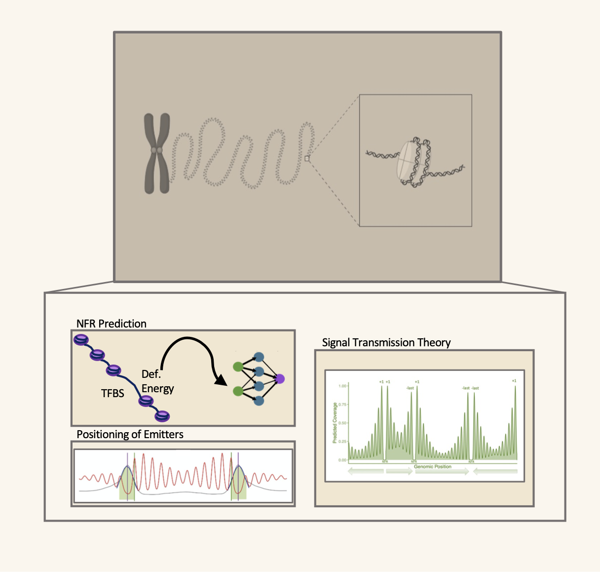

# NucleosomePeriodicity

This repository contains the code used in the article "An integrated machine-learning model to predict nucleosome architecture" by Sala et al. published in NAR. The model combines a neural network to predict nucleosome free regions together with a statistical positioning methodology to reconstitute intragenic nucleosome architectures.

### Table of Contents
- [Required Tools and Packages](#Required-Tools-and-Packages)
- [Nucleosome Data](#Nucleosome-Data)
- [Data Model](#Data-Model)
  - [Running the classifier](#Running-the-classifier)
  - [Signal Transmission Theory](#STT)
 

### Required Tools and Packages

* python (used version 3.9.18)
  - numpy
  - pandas
  - matplotlib
  - json
  - sklearn
  - tensorflow
  - keras
      
* R (used version 3.6.3)
  - nucleR
  - IRanges
  - rtracklayer
  - GenomicRanges

### Nucleosome Data
Nucleosome data was extracted from MNase-seq paired-end reads which were mapped to the yeast genome (SacCer3, UCSC). The sequencing profiles are processed using nucleR, an R package that is able to score how well positioned a nucleosome is based on its occupancy and variability. All the data used and generated for this project can be found in the `data` directory.

### Data Model

The integrated prediction of nucleosome architectures within gene bodies is a results of the combination of 3 steps:

1. A neural network predictor of nucleosome free regions.
2. The positioning of the emitters from the fitted prediction peaks (see article for more details).
3. Transmission theory by signal decays from the found emitters.

##### Running the classifier

The current version with the classifier details can be found at `nfr_clf.py`. To run the classifier and reproduce the results simply run:

`python main.py`

##### Signal Transmission Theory

Once the emitters have been found, the last step is to send signals from both the first and last emitter and reproduce the overall architecture. To run the STT method simply run:

`Rscript PeriodicPosition.R`

